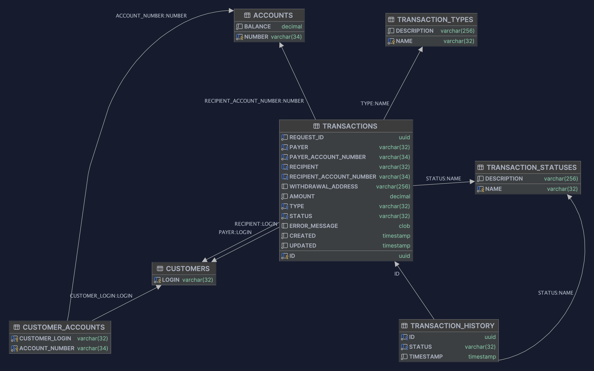
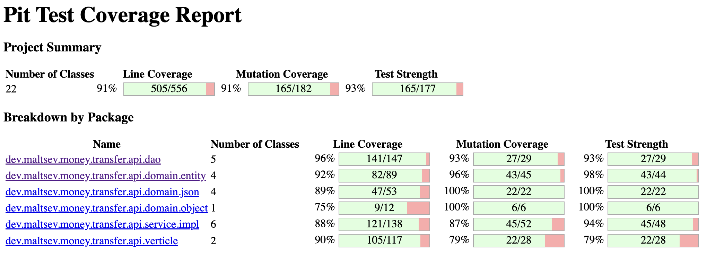

### Summary:

Design and implement a RESTful API (including data model and the backing implementation) with following functional requirements:

- User can send money from their account to another users account
- User can send money from their account to an external withdrawal address through an API (API Stub is provided)
- User can see operation progress

### Requirements:

- Written in Java, Kotlin, or Scala using Java Runtime version 17+
- Has REST API
- Assume the API is invoked by multiple systems and services in the same time on behalf of end users.
- Datastore runs in memory for the sake of simplicity
- Runs standalone and doesn't require external pre-installed dependencies like docker
- Use well-known build manager like gradle or maven

### Goals:

- To demonstrate high quality code and solution design
- To demonstrate ability to produce solution without detailed requirements
- To demonstrate the API and functional requirements are working correctly
- Solution should be close to reality
- You can use any framework or library, but you must keep solution simple and straight to the point (hint: we’re not using Spring)

### Non-goals:

- Not to show ability to use frameworks - The goal of the task is to show fundamentals, not framework knowledge
- No need to implement non-functional pieces, like authentication, monitoring or logging

Please upload solution to the Github, Bitbucket or Gitlab

### Withdrawal API stub (Must be used as is and not be modified in any way, with only exception to T):

```java
import java.util.Objects;
import java.util.UUID;
import java.util.concurrent.ConcurrentHashMap;
import java.util.concurrent.ConcurrentMap;
import java.util.concurrent.ThreadLocalRandom;

import static dev.maltsev.money.transfer.api.service.impl.WithdrawalService.WithdrawalState.COMPLETED;
import static dev.maltsev.money.transfer.api.service.impl.WithdrawalService.WithdrawalState.FAILED;
import static dev.maltsev.money.transfer.api.service.impl.WithdrawalService.WithdrawalState.PROCESSING;

interface WithdrawalService {
    /**
     * Request a withdrawal for given address and amount. Completes at random moment between 1 and 10 seconds
     * @param id - a caller generated withdrawal id, used for idempotency
     * @param address - an address withdraw to, can be any arbitrary string
     * @param amount - an amount to withdraw (please replace T with type you want to use)
     * @throws IllegalArgumentException in case there's different address or amount for given id
     */
    void requestWithdrawal(WithdrawalId id, Address address, T amount); // Please substitute T with prefered type

    /**
     * Return current state of withdrawal
     * @param id - a withdrawal id
     * @return current state of withdrawal
     * @throws IllegalArgumentException in case there no withdrawal for the given id
     */
    WithdrawalState getRequestState(WithdrawalId id);

    enum WithdrawalState {
        PROCESSING, COMPLETED, FAILED
    }

    record WithdrawalId(UUID value) {
    }

    record Address(String value) {
    }
}

class WithdrawalServiceStub implements WithdrawalService {
    private final ConcurrentMap<WithdrawalId, Withdrawal> requests = new ConcurrentHashMap<>();

    @Override
    public void requestWithdrawal(WithdrawalId id, Address address, T amount) { // Please substitute T with prefered type
        final var existing = requests.putIfAbsent(id, new Withdrawal(finalState(), finaliseAt(), address, amount));
        if (existing != null && !Objects.equals(existing.address, address) && !Objects.equals(existing.amount, amount))
            throw new IllegalStateException("Withdrawal request with id[%s] is already present".formatted(id));
    }

    private WithdrawalState finalState() {
        return ThreadLocalRandom.current().nextBoolean() ? COMPLETED : FAILED;
    }

    private long finaliseAt() {
        return System.currentTimeMillis() + ThreadLocalRandom.current().nextLong(1000, 10000);
    }

    @Override
    public WithdrawalState getRequestState(WithdrawalId id) {
        final var request = requests.get(id);
        if (request == null)
            throw new IllegalArgumentException("Request %s is not found".formatted(id));
        return request.finalState();
    }

    record Withdrawal(WithdrawalState state, long finaliseAt, Address address, T amount) {
        public WithdrawalState finalState() {
            return finaliseAt <= System.currentTimeMillis() ? state : PROCESSING;
        }
    }
}

```

## Notes

### Tech stack

- JRE 20.0.2
- Maven 3.8.2 - build system
- Vertx 4.4.5 - http server & async framework
- HSQLDB 2.7.1 - in-memory database
- Sql2o 1.6.0 - JDBC wrapper library

### Domain model



### API

[Swagger](./src/main/resources/swagger.yaml) or run application and open http://localhost:8080

### Component diagram

To be added

### Build

Maven wrapper is used as a build system.

```bash
> ./mvnw clean package
```

Executable jar can be found in `./target/money-transfer-api-1.0-SNAPSHOT.jar`.

#### Build with test coverage report

To build with pitest mutational test coverage report use:

```bash
> ./mvnw clean package org.pitest:pitest-maven:mutationCoverage
```

Test coverage report can be found in `./target/pit-reports/index.html`



### Run

To run the program use:

```bash
> java -jar ./target/money-transfer-api-1.0-SNAPSHOT.jar
```